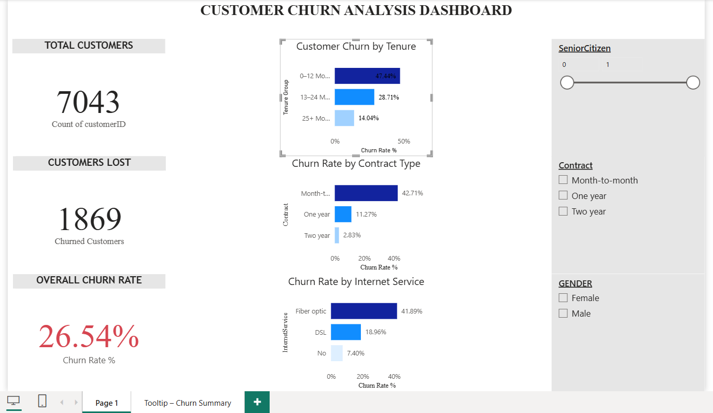
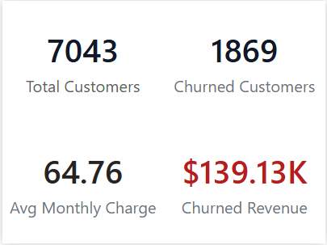

# Customer Churn Analysis (SQL | Python | Excel | Power BI)

## 📌 Project Overview
This project analyzes customer churn for a telecom company using SQL, Python, Excel, and Power BI.  
The goal is to identify churn patterns, key risk factors, and revenue impact to support business decisions.

---

## 🛠 Tools & Technologies
- **SQL** – Data exploration and churn queries
- **Python (Pandas, Matplotlib, Seaborn)** – Data cleaning and analysis
- **Excel** – Pivot tables and summary analysis
- **Power BI** – Interactive dashboard and tooltips

---

## 📊 Key Metrics
- Total Customers
- Churned Customers
- Churn Rate (%)
- Average Monthly Charges
- Churned Revenue

---

## 📈 Power BI Dashboard Features
- Churn Rate by Tenure Group
- Churn Rate by Contract Type
- Churn Rate by Internet Service
- Interactive slicers (Gender, Contract, Senior Citizen)
- Custom tooltip with:
  - Total Customers
  - Churned Customers
  - Avg Monthly Charges
  - Churned Revenue

---

## 🖼 Dashboard Preview

### Overall Dashboard

### Dashboard with Tooltip

### Tooltip Summary

---

## 🔍 Key Insights
- Customers on **month-to-month contracts** show the highest churn
- **Fiber optic** users churn more than DSL users
- Churn is highest in the **0–12 months tenure group**
- Higher monthly charges correlate with higher churn risk

---

## 📂 Repository Structure
- `data/` – Raw dataset
- `sql/` – SQL queries
- `python/` – Python analysis
- `excel/` – Excel analysis
- `powerbi/` – Power BI dashboard
- `screenshots/` – Dashboard visuals

---

## 👤 Author
**Mukesh**  
Aspiring Data Analyst | Data Scientist

---

## 📌 Note
This project is intended for learning and portfolio demonstration purposes.

